# رصد (Rasad) — نظام موحّد لبلاغات الخدمات الحكومية

نظام Full-Stack يتيح للمواطن تقديم بلاغ عن مشكلة خدمية (طريق، مياه، كهرباء، نفايات) بلغته الطبيعية، يصنّفه تلقائياً، يوجّهه للجهة المختصة، يعرضه على خريطة تفاعلية ملوّنة حسب الحالة، ويُشعر المواطن ببريد إلكتروني عند تحديث حالة بلاغه.

🔗 **تجربة مباشرة:** [rasad-client.onrender.com](https://rasad-client.onrender.com/)

> ⚠️ المشروع مستضاف على الخطة المجانية من Render، فقد يستغرق السيرفر حتى دقيقة للاستيقاظ (cold start) عند أول زيارة بعد فترة عدم استخدام.

---

## 📌 الفكرة

الأنظمة الحكومية التقليدية لتلقي البلاغات غالباً نماذج تعبئة ثابتة تحتاج تصنيف يدوي من الموظف، وتفتقر لتغذية راجعة واضحة للمواطن. **رصد** يقدّم بديل متكامل:

1. المواطن يكتب المشكلة بكلامه العادي — لا قوائم منسدلة معقّدة
2. النظام يصنّفها فوراً وتلقائياً إلى الجهة المسؤولة
3. البلاغ يُوجَّه تلقائياً لموظفي القسم المعني فقط (طرق، مياه، كهرباء، نفايات)
4. يُحدَّد موقعه على خريطة تفاعلية، ملوّنة حسب حالة المعالجة
5. النظام يحلل البلاغات المتراكمة لإبراز "مناطق ساخنة" تحتاج تدخّل استباقي
6. المواطن يُشعَر تلقائياً ببريد إلكتروني فور تغيير حالة بلاغه

التصنيف الآلي هنا **مساعد لا يحل محل القرار البشري** — كل تصنيف تلقائي يبقى عليه علامة "مبدئي" (`categoryConfirmed: false`) حتى يراجعه ويؤكده موظف بشري.

---

## 🛠 التقنيات

**Frontend:** React, Redux Toolkit, React Router, Leaflet + React-Leaflet (خرائط تفاعلية ملوّنة), Recharts (مخططات)
**Backend:** Node.js, Express, MongoDB + Mongoose, JWT للمصادقة, express-rate-limit
**التصنيف:** نظام كلمات مفتاحية مجاني بالكامل (افتراضي)، مع دعم اختياري لـ Anthropic Claude API لتصنيف أدق عند توفر مفتاح API
**البريد الإلكتروني:** Nodemailer عبر Gmail SMTP لإشعارات حقيقية تلقائية

---

## ✨ الميزات

### المصادقة والصلاحيات
- تسجيل دخول حقيقي بـ JWT (وليس فقط إرسال بيانات المستخدم بدون حماية)
- 3 أدوار: مواطن (يقدّم بلاغ) / موظف (يدير بلاغات قسمه) / مدير (admin)
- موظف يختار **قسمه** عند التسجيل (طرق / مياه / كهرباء / نفايات / عام)

### تقديم البلاغ
- وصف نصي حر بالعربية، بدون قوائم تصنيف معقّدة
- رفع صورة اختيارية، مع تحقق من نوع الملف (JPG/PNG/WEBP فقط) وحجمه (حد 5MB)
- تحديد الموقع تلقائياً عبر Geolocation API، يُحفظ كـ GeoJSON لدعم استعلامات جغرافية

### التصنيف التلقائي (مرن وبدون تكلفة إلزامية)
- **افتراضياً:** تصنيف فوري بالكلمات المفتاحية (مجاني 100%، لا يحتاج أي مفتاح API)
- **اختياري:** لو توفر `ANTHROPIC_API_KEY`، يُستخدم Claude لتصنيف أدق تلقائياً بدون أي تعديل بالكود
- لو فشل استدعاء الذكاء الاصطناعي لأي سبب (شبكة، رصيد)، يرجع تلقائياً للكلمات المفتاحية بدل ترك البلاغ بدون تصنيف
- الموظف يقدر يؤكد أو يغيّر التصنيف يدوياً بأي وقت (شارة 🤖 "مبدئي" تختفي بعد التأكيد البشري)

### التوجيه حسب الجهة
- موظف بقسم محدد (مثل "طرق") يشاهد **تلقائياً فقط** البلاغات بتصنيف قسمه — بالجدول، الإحصائيات، المخطط، والمناطق المتكررة معاً، باتساق كامل
- خيار "عرض كل الأقسام" لموظف يحتاج نظرة شاملة عابرة للأقسام
- موظف بقسم "عام" (أو admin) يشاهد كل البلاغات افتراضياً

### لوحة تحكم الموظف
- إحصائيات فورية: إجمالي البلاغات، توزيعها حسب التصنيف (مخطط Recharts)
- عرض صورة مصغّرة لكل بلاغ بالجدول، قابلة للتكبير بنافذة منبثقة
- تغيير حالة البلاغ (جديد / قيد المعالجة / تم الحل / مرفوض) وتصنيفه مباشرة من الجدول
- تحليل "مناطق ساخنة": مناطق فيها 3+ بلاغات بآخر 30 يوم، مع تفصيل التصنيفات بكل منطقة

### الخريطة التفاعلية
- عرض كل البلاغات كنقاط ملوّنة حسب الحالة (🟡 جديد، 🔵 قيد المعالجة، 🟢 تم الحل، 🔴 مرفوض)
- مفتاح ألوان (Legend) واضح فوق الخريطة
- نافذة منبثقة بكل نقطة تعرض التفاصيل والحالة بلونها المطابق

### الإشعارات
- بريد إلكتروني حقيقي (Gmail SMTP عبر Nodemailer) يُرسل تلقائياً للمواطن عند **تغيير حالة** بلاغه فقط (لا إشعار عند تعديل التصنيف وحده، لتجنّب رسائل غير ضرورية)
- الإرسال غير متزامن (Async) فلا يؤخر استجابة الموظف
- النظام بالكامل **اختياري التفعيل** — لو متغيرات البريد غير موجودة بـ `.env`، يتخطى الإرسال بهدوء دون أي خطأ

### الأمان
- تحقق من الملكية: لا يمكن لمستخدم حذف أو تعديل بلاغ غيره
- Rate limiting على تسجيل الدخول (10 محاولات / 15 دقيقة) لمنع التخمين
- لا أسرار حقيقية بالكود — `.env.example` فقط، مع `.gitignore` يحمي `.env` الفعلي

---

## 📸 لقطات من النظام

**تسجيل الدخول**

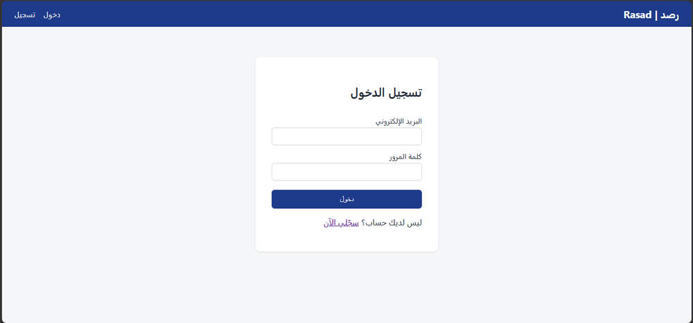

**إنشاء حساب جديد** — اختيار نوع الحساب (مواطن / موظف)

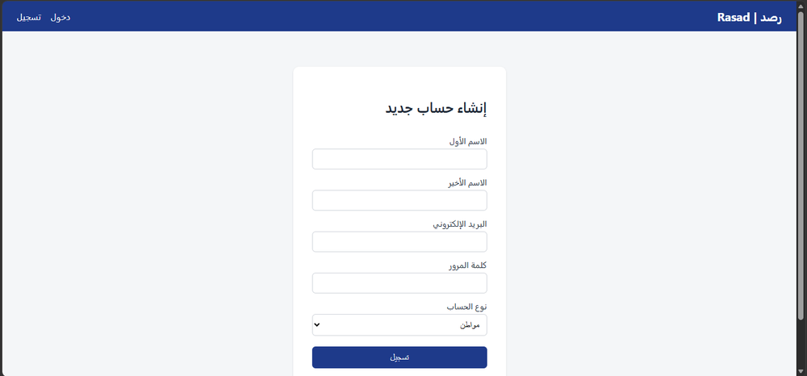

موظف جهة حكومية يحدّد قسمه عند التسجيل (طرق / مياه / كهرباء / نفايات / عام):

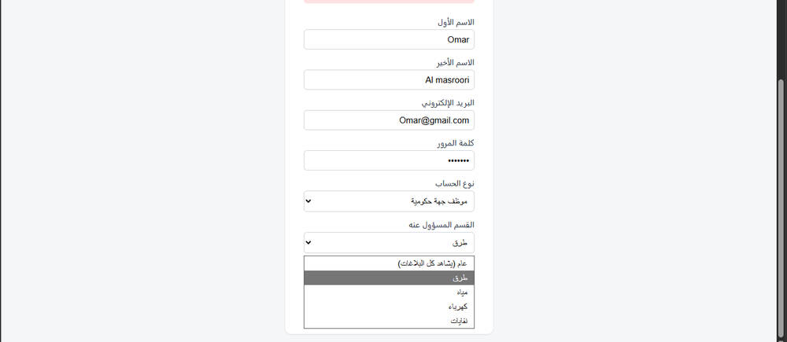

**تقديم بلاغ جديد** — وصف نصي حر، صورة اختيارية، وتحديد الموقع

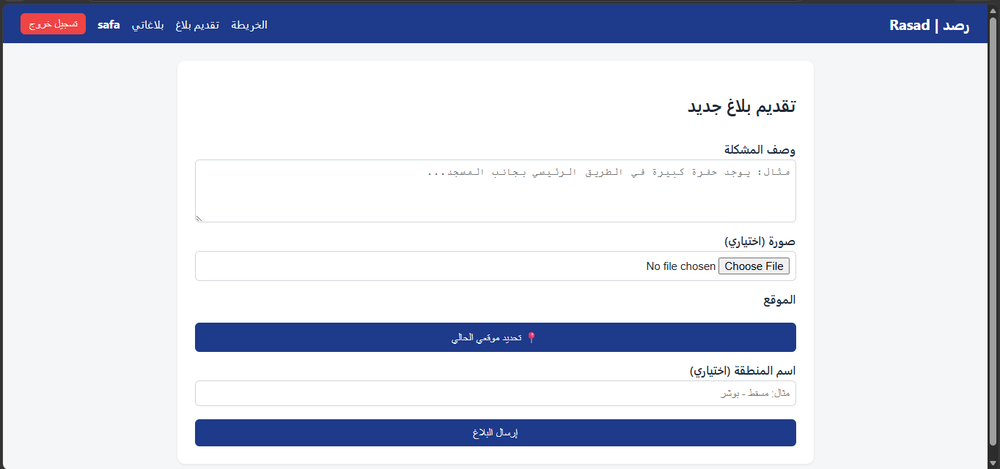

تعبئة النموذج مع رفع صورة وتحديد الموقع تلقائياً:

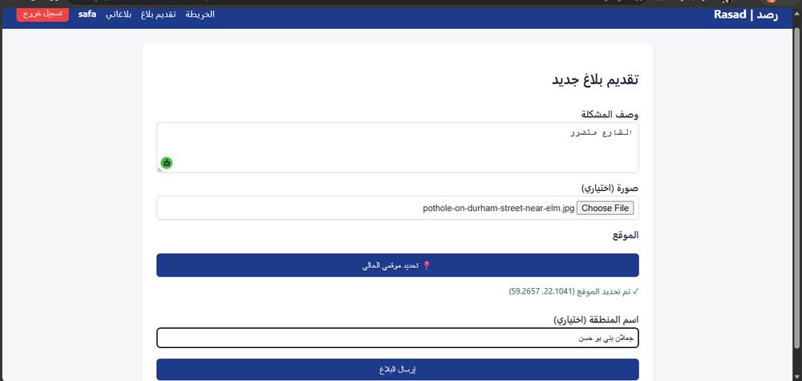

تأكيد استلام البلاغ مع التصنيف المبدئي بالذكاء الاصطناعي:

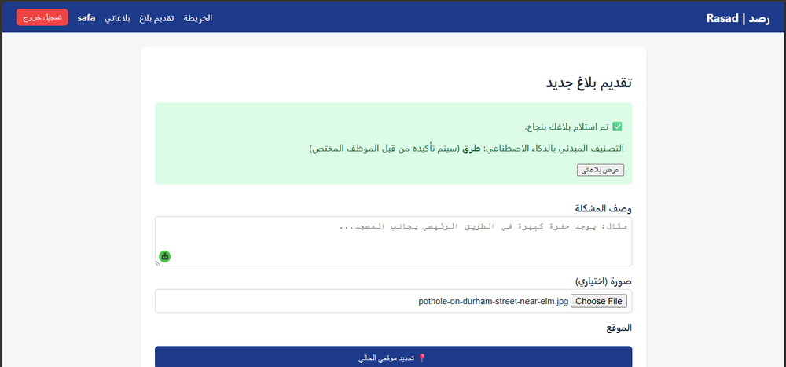

**الخريطة التفاعلية** — البلاغات معروضة كنقاط ملوّنة حسب الحالة مع مفتاح ألوان واضح

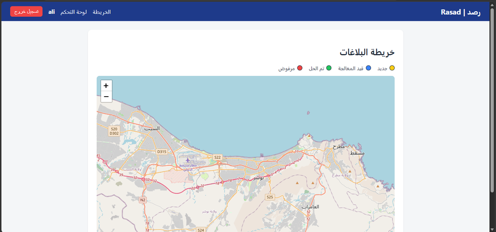

**لوحة تحكم الموظف** — إحصائيات فورية وتوزيع البلاغات حسب التصنيف

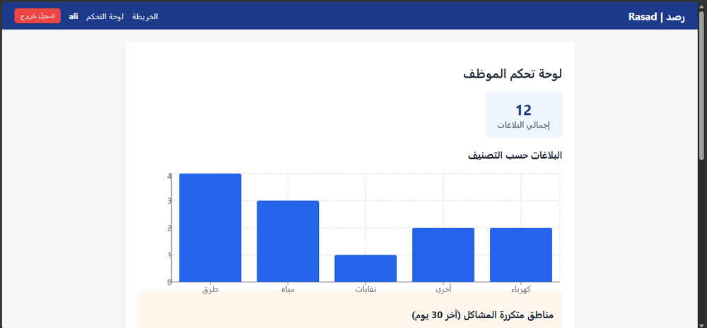

تصفية تلقائية حسب قسم الموظف، مع خيار عرض كل الأقسام والمناطق المتكررة:

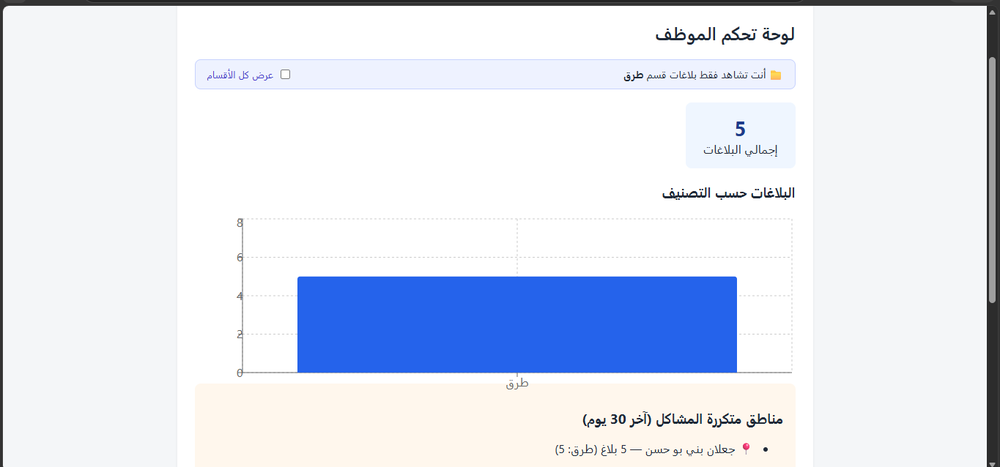

جدول البلاغات مع إمكانية تغيير الحالة والتصنيف مباشرة:

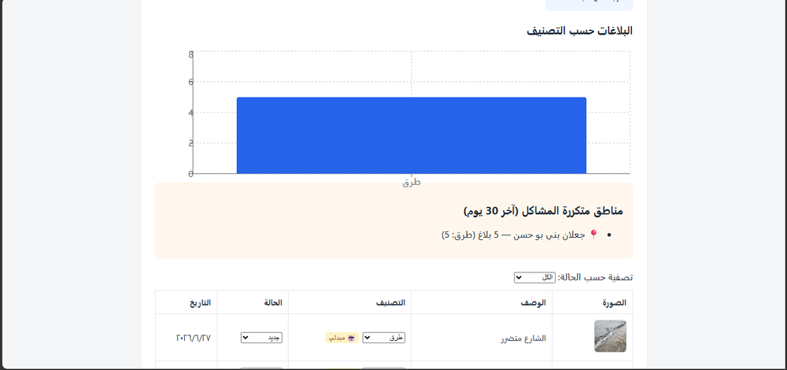

تكبير صورة البلاغ من نافذة منبثقة:

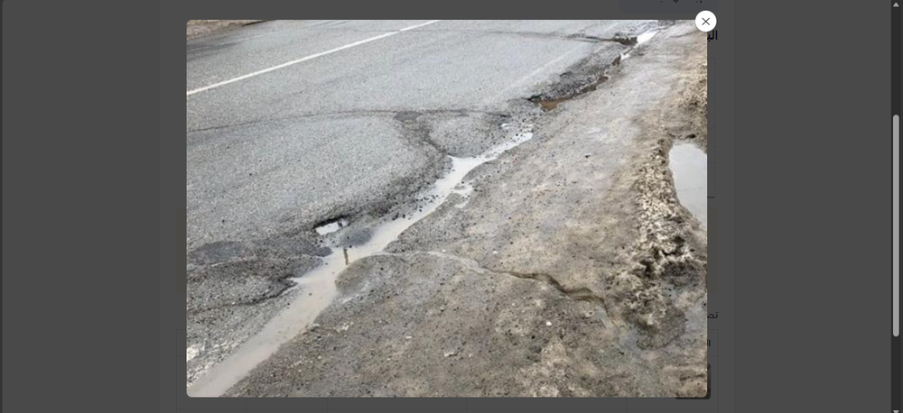

**إشعار البريد الإلكتروني** — يُرسل تلقائياً للمواطن عند تغيير حالة بلاغه

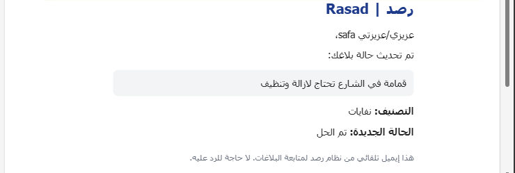

---

## 🔒 الأمان (الفرق الجوهري عن مشروع VOX السابق)

| نقطة | VOX (المشروع السابق) | رصد (هذا المشروع) |
|---|---|---|
| المصادقة | لا يوجد — الفرونت إند يرسل `userId` مباشرة | JWT حقيقي، السيرفر يستخرج هوية المستخدم من التوكن |
| الحذف/التعديل | أي شخص يعرف الـ id يقدر يحذف | تحقق من الملكية (`req.user.id === resource.owner`) قبل أي تعديل |
| رفع الملفات | يقبل أي امتداد وحجم | حد 5MB + امتدادات صور فقط |
| محاولات الدخول | غير محدودة | Rate limiting (10 محاولات / 15 دقيقة) |
| أسرار الاتصال | `.env` مرفوع فعلياً على GitHub | `.env.example` بدون قيم حقيقية + `.gitignore` |

---

## ▶️ التشغيل المحلي

### 1. السيرفر
```bash
cd server
npm install
cp .env.example .env
# عدّلي القيم بملف .env (التفاصيل بالأسفل)
npm run dev
```

### 2. الواجهة
```bash
cd client
npm install
cp .env.example .env
npm start
```

التطبيق يفتح على `http://localhost:3000`

### متغيرات البيئة (`server/.env`)

| المتغير | مطلوب؟ | الوصف |
|---|---|---|
| `MONGODB_URI` | ✅ مطلوب | رابط اتصال MongoDB Atlas |
| `JWT_SECRET` | ✅ مطلوب | نص عشوائي طويل لتوقيع التوكنات (بدون مسافات) |
| `PORT` | اختياري | منفذ السيرفر، افتراضياً 3001 |
| `CLIENT_URL` | اختياري | رابط الواجهة للسماح بـ CORS |
| `ANTHROPIC_API_KEY` | اختياري | لو موجود، يُستخدم Claude للتصنيف الأدق؛ بدونه، يُستخدم التصنيف المجاني بالكلمات المفتاحية تلقائياً |
| `EMAIL_USER` | اختياري | بريد Gmail لإرسال إشعارات الحالة؛ بدونه، الإرسال يتخطّى بهدوء |
| `EMAIL_APP_PASSWORD` | اختياري | App Password من إعدادات أمان Google (وليس كلمة مرور الحساب العادية) |

---

## 📂 بنية المشروع

```
rasad/
├── server/
│   ├── Models/            (User, Report)
│   ├── routes/             (auth, report)
│   ├── middleware/          (auth.js — JWT verification)
│   ├── services/
│   │   ├── classifyReport.js     (يوجّه بين الكلمات المفتاحية وClaude)
│   │   ├── keywordClassifier.js  (تصنيف مجاني بالكلمات المفتاحية)
│   │   └── sendEmail.js          (إشعارات بريد إلكتروني عبر Gmail SMTP)
│   └── index.js
├── client/
│   └── src/
│       ├── Components/     (Login, Register, SubmitReport, ReportsMap,
│       │                    EmployeeDashboard, MyReports, Header...)
│       ├── Features/        (Redux slices: auth, reports)
│       └── app/Store.js
└── screenshots/             (لقطات شاشة لواجهات النظام، مستخدمة في هذا الـ README)
```

---

## 🚧 خطوات مستقبلية مقترحة

- صفحة تفاصيل بلاغ مفردة مع سجل تتبع الحالة (timeline)
- دعم تعدد اللغات (عربي/إنجليزي) بشكل ديناميكي
- اختبارات تلقائية (Jest/Vitest) لمسارات السيرفر الحرجة
- إيميل ترحيبي تلقائي عند التسجيل + تنبيه فوري للموظفين عند وصول بلاغ جديد بقسمهم

---

## 👩‍💻 المطوّرة

صفا الشكيلية
طالبة هندسة برمجيات — جامعة التقنية والعلوم التطبيقية (UTAS) - إبراء
